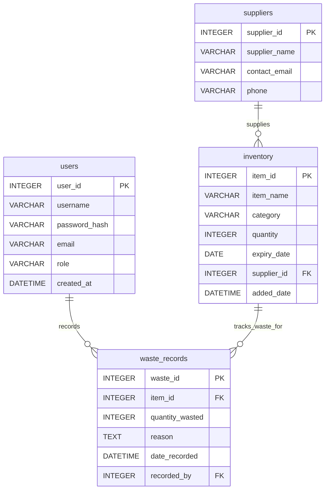

# Food Waste Reduction Platform

## Project BFB321 - Group 15
*University of Pretoria - Faculty of Engineering*  
*Built Environment and Information Technology*

### Team Members:
- MASINGE T.E - u22592220
- MANTHATA F - u21574830  
- MAUBANE L.S - u22629689
- CELE M.K - u23749556

### Project Overview
A web-based platform designed to reduce retail food waste through improved supply chain and inventory control. The system provides real-time inventory tracking, demand forecasting, and expiry alerts to help retailers minimize food waste.

### Features
- *Role-based Dashboard* (Employee & Manager views)
- *Real-time Inventory Management*
- *Demand Forecasting Module*
- *Expiry Alert System*
- *User Authentication*

### Technology Stack
- HTML5, CSS3, JavaScript
- Local Storage for data persistence
- Responsive Web Design

### How to Run
1. Clone this repository
2. Open login.html in a web browser
3. Use demo credentials:
   - Manager: manager@foodsave.com / pass123
   - Employee: emp@foodsave.com / pass123

### Project Structure
# BFB Food Waste Project

## Database Entity Relationship Diagram

